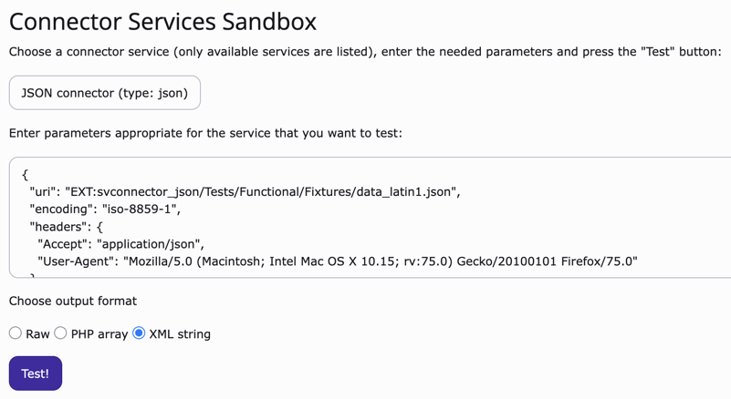

.. ==================================================
.. FOR YOUR INFORMATION
.. --------------------------------------------------
.. -*- coding: utf-8 -*- with BOM.

.. include:: ../Includes.txt

.. _introduction:

Introduction
------------

The main idea of Connector services is to have a basic framework for
developing scripts that connect to third-party applications and
retrieve data from them. The new type for these services is
"connector" and every third-party application is represented by a
distinct sub-type.

This structure makes connection scripts reusable. It also makes them
easier to use thanks to a general API. Connector services can be
called both from the fronted and the backend. An example of extension
using connector services is “external\_import”.

.. _screenshots:

Screenshots
^^^^^^^^^^^

A view of the BE module which makes it possible to test connections
and the data they return.

   A view of the connector test module in the BE

.. _suport:

Questions and support
^^^^^^^^^^^^^^^^^^^^^

If you have any questions about this extension, please ask them in the
TYPO3 English mailing list, so that others can benefit from the
answers. Please use the bug tracker on forge.typo3.org to report
problem or suggest features
(http://forge.typo3.org/projects/extension-svconnector/issues).

.. _happy-developer:

Keeping the developer happy
^^^^^^^^^^^^^^^^^^^^^^^^^^^

Every encouragement keeps the developer ticking, so dont' hesitate
to send thanks or share your enthusiasm about the extension.
If you really want to give something
back, you may consider my Amazon wish list:
http://www.amazon.co.uk/registry/wishlist/G7DI2AN99Y4F

You may also take a step back and reflect about the beauty of sharing.
Think about how much you are benefiting and how much yourself is
giving back to the community.
